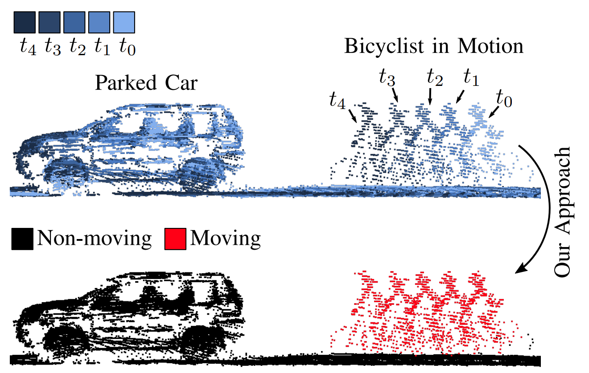
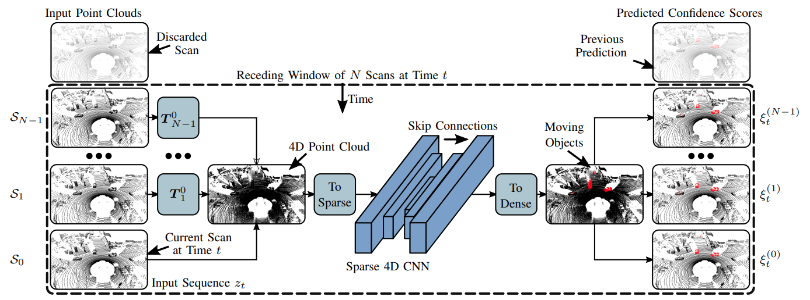
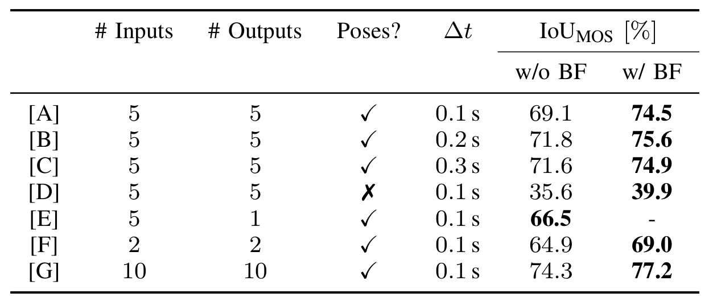

# Receding Moving Object Segmentation in 3D LiDAR Data Using Sparse 4D Convolutions
[](src/vdbfusion/pybind)
[](https://svgshare.com/i/Zhy.svg)
[](https://github.com/PRBonn/vdbfusion/pulls)
[](https://www.ipb.uni-bonn.de/wp-content/papercite-data/pdf/mersch2022ral.pdf)
[](https://lbesson.mit-license.org/)


*Our moving object segmentation on the unseen SemanticKITTI test sequences 18 and 21. Red points are predicted as moving.*

## Table of Contents
1. [Publication](#publication)
2. [Overview](#overview)
3. [Data](#data)
4. [Installation](#installation)
5. [Running the Code](#running-the-code)
6. [Evaluation and Visualization](#evaluation-and-visualization)
7. [Pretrained Model](#pretrained-models)
8. [License](#license)

## Publication
If you use our code in your academic work, please cite the corresponding [paper](https://www.ipb.uni-bonn.de/wp-content/papercite-data/pdf/mersch2022ral.pdf):
    
```latex
@article{mersch2022ral,
author = {B. Mersch and X. Chen and I. Vizzo and L. Nunes and J. Behley and C. Stachniss},
title = {{Receding Moving Object Segmentation in 3D LiDAR Data Using Sparse 4D Convolutions}},
journal={IEEE Robotics and Automation Letters (RA-L)},
year = 2022,
}
```

## Overview

<p align="center">
    
</p>

*Given a sequence of point clouds, our method segments moving (red) from non-moving (black) points.*

<p align="center">
    
</p>

*We first create a sparse 4D point cloud of all points in a given receding window. We use sparse 4D convolutions from the [MinkowskiEngine](https://github.com/NVIDIA/MinkowskiEngine) to extract spatio-temporal features and predict per-points moving object scores.*

## Data
Download the SemanticKITTI data from the official [website](http://www.semantic-kitti.org/dataset.html#download).
```
./
└── sequences
  ├── 00/           
  │   ├── velodyne/	
  |   |	├── 000000.bin
  |   |	├── 000001.bin
  |   |	└── ...
  │   └── labels/ 
  |       ├── 000000.label
  |       ├── 000001.label
  |       └── ...
  ├── 01/ # 00-10 for training
  ├── 08/ # for validation
  ├── 11/ # 11-21 for testing
  └── ...
```

## Installation
Clone this repository in your workspace with
```
git clone https://github.com/PRBonn/4DMOS
```

### With Docker
We provide a ```Dockerfile``` and a ```docker-compose.yaml``` to run all docker commands with a simple ```Makefile```.

To use it, you need to
1. [Install Docker](https://docs.docker.com/desktop/linux/install/)
2. Install docker-compose with

    ```bash
    sudo apt-get install docker-compose
    ```

3. Install the [NVIDIA Container Toolkit](https://docs.nvidia.com/datacenter/cloud-native/container-toolkit/install-guide.html)
4. **IMPORTANT** To have GPU access during the build stage, make ```nvidia``` the default runtime in ```/etc/docker/daemon.json```:

    ```yaml
    {
        "runtimes": {
            "nvidia": {
                "path": "/usr/bin/nvidia-container-runtime",
                "runtimeArgs": []
            } 
        },
        "default-runtime": "nvidia" 
    }
    ```
    Save the file and run ```sudo systemctl restart docker``` to restart docker.

5. Build the image with all dependendencies with

    ```bash
    make build
    ```

Before running the container, you need to set the path to your dataset:

```bash
export DATA=path/to/dataset/sequences
```

To test that your container is running propoerly, do

```bash
make test
```

Finally, run the container with

```bash
make run
```

You can now work inside the container and run the training and inference scripts.

### Without Docker
Without Docker, you need to install the dependencies specified in the ```setup.py```. This can be done in editable mode by running

```bash
python3 -m pip install --editable .
```

When installing the MinkowskiEngine, your CUDA version has to match the CUDA version that was used to compile PyTorch. If you run into problems installing the MinkowskiEngine, please have a look at the original [MinkowskiEngine](https://github.com/NVIDIA/MinkowskiEngine) repo and their [installation wiki page](https://github.com/NVIDIA/MinkowskiEngine/wiki/Installation).

## Running the Code
If not done yet, specify the path to the SemanticKITTI data:

```bash
export DATA=path/to/dataset/sequences
```

If you use Docker, you now need to run the container with ```make run```.

### Training
To train a model with the parameters specified in ```config/config.yaml```, run

```bash
python scripts/train.py
```

Find more options like loading weights from a pre-trained model or checkpointing by passing the ```--help``` flag to the command above.

### Inference
Inference is done in two steps. First, predicting moving object confidence scores and second, fusing multiple confidence values to get a final prediction (non-overlapping strategy or binary Bayes filter.

To infer the per-point confidence scores for a model checkpoint at ```path/to/model.ckpt```, run

```bash
python scripts/predict_confidences.py -w path/to/model.ckpt
```

We provide several additional options, see ```--help``` flag. The confidence scores are stored in ```predictions/ID/POSES/confidences``` to distinguish setups using different model IDs and pose files.

Next, the final moving object predictions can be obtained by

```bash
python scripts/confidences_to_labels.py -p predictions/ID/POSES
```
You can use the ```--strategy``` argument to decide between the non-overlapping or bayesian filter strategy from the paper. Run with ```--help``` to see more options. The final predictions are stored in ```predictions/ID/POSES/labels/```.

## Evaluation and Visualization
We use the [SemanticKITTI API](https://github.com/PRBonn/semantic-kitti-api) to evaluate the intersection-over-union (IOU) of the moving class as well as to visualize the predictions.

## Pretrained Models
<p align="center">
    
</p>

* [Model [A]: 5 scans @ 0.1s](https://www.ipb.uni-bonn.de/html/projects/4DMOS/5_scans.zip)
* [Model [B]: 5 scans @ 0.2s](https://www.ipb.uni-bonn.de/html/projects/4DMOS/5_scans_dt_0p2.zip)
* [Model [C]: 5 scans @ 0.3s](https://www.ipb.uni-bonn.de/html/projects/4DMOS/5_scans_dt_0p3.zip)
* [Model [D]: 5 scans, no poses](https://www.ipb.uni-bonn.de/html/projects/4DMOS/5_scans_no_poses.zip)
* [Model [E]: 5 scans input, 1 scan output](https://www.ipb.uni-bonn.de/html/projects/4DMOS/5_scans_single_output.zip)
* [Model [F]: 2 scans](https://www.ipb.uni-bonn.de/html/projects/4DMOS/2_scans.zip)
* [Model [G]: 10 scans](https://www.ipb.uni-bonn.de/html/projects/4DMOS/10_scans.zip)

## License
This project is free software made available under the MIT License. For details see the LICENSE file.
